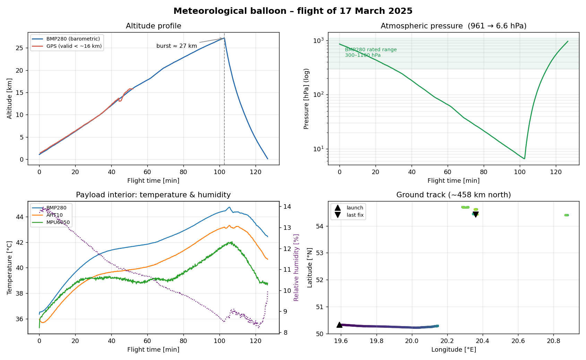
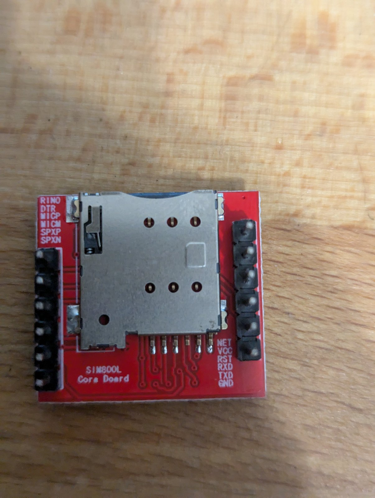
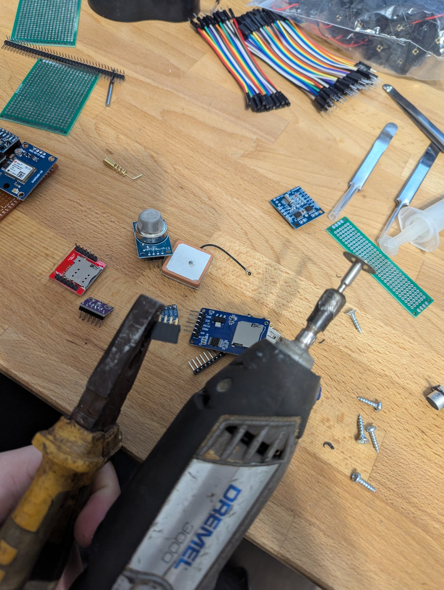
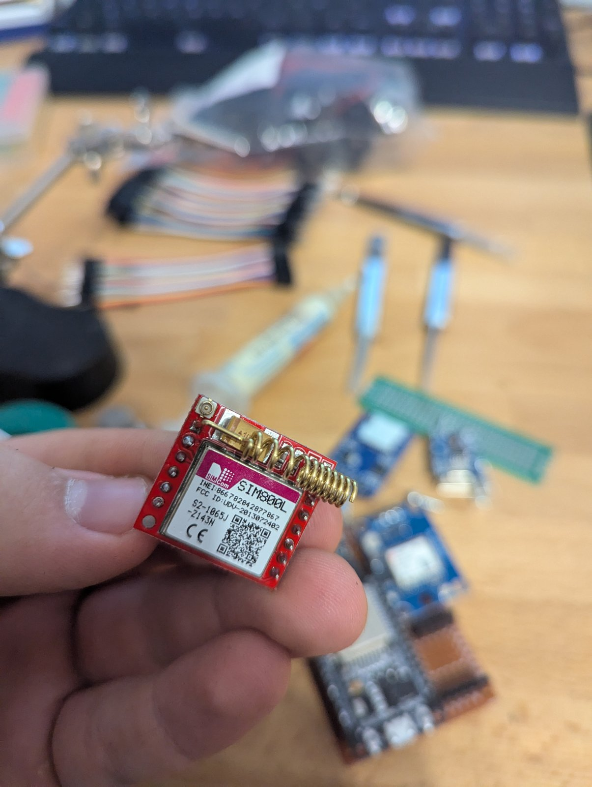
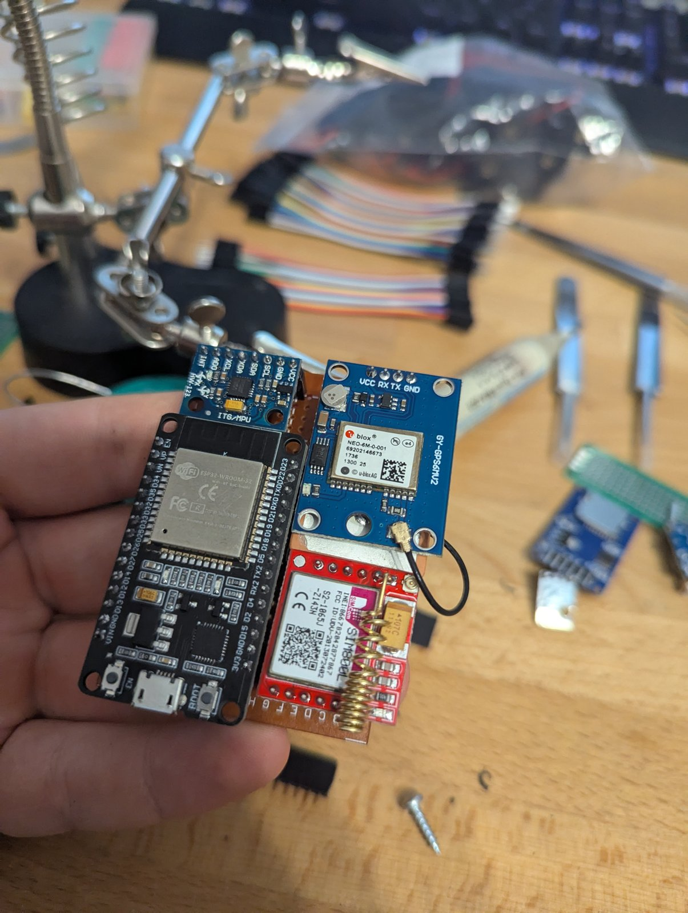
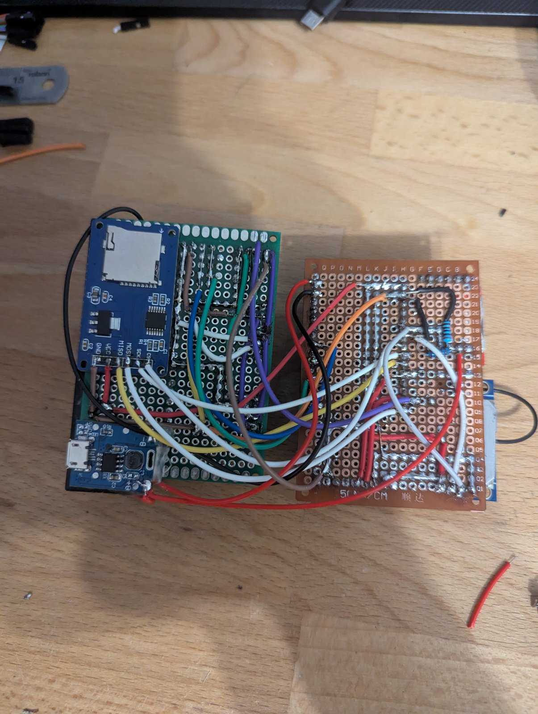
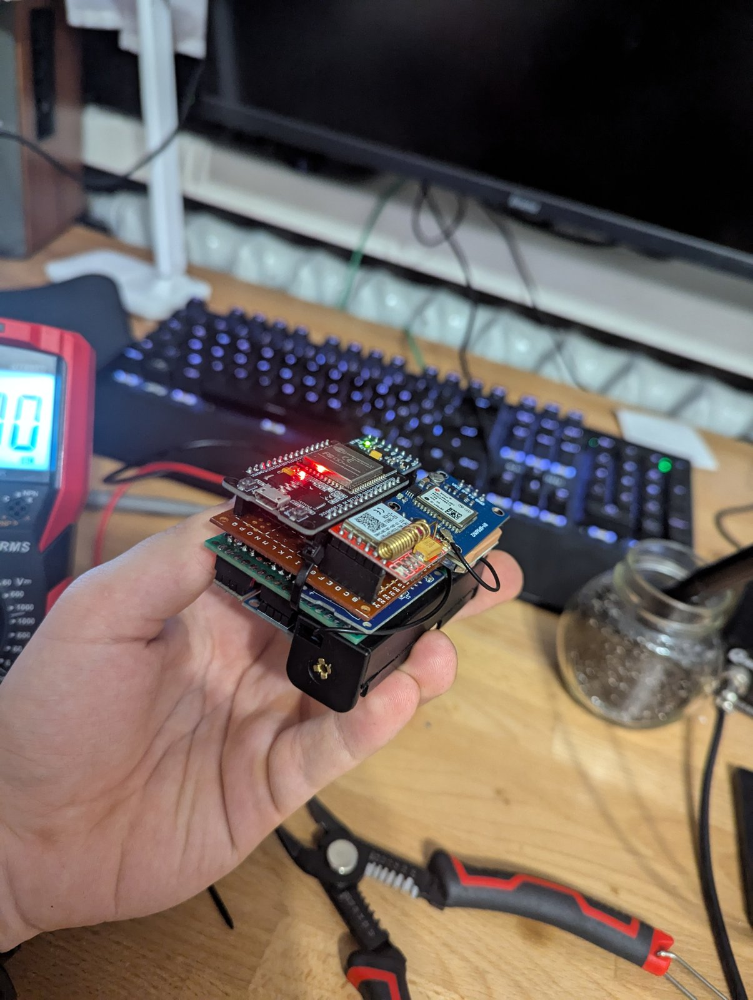
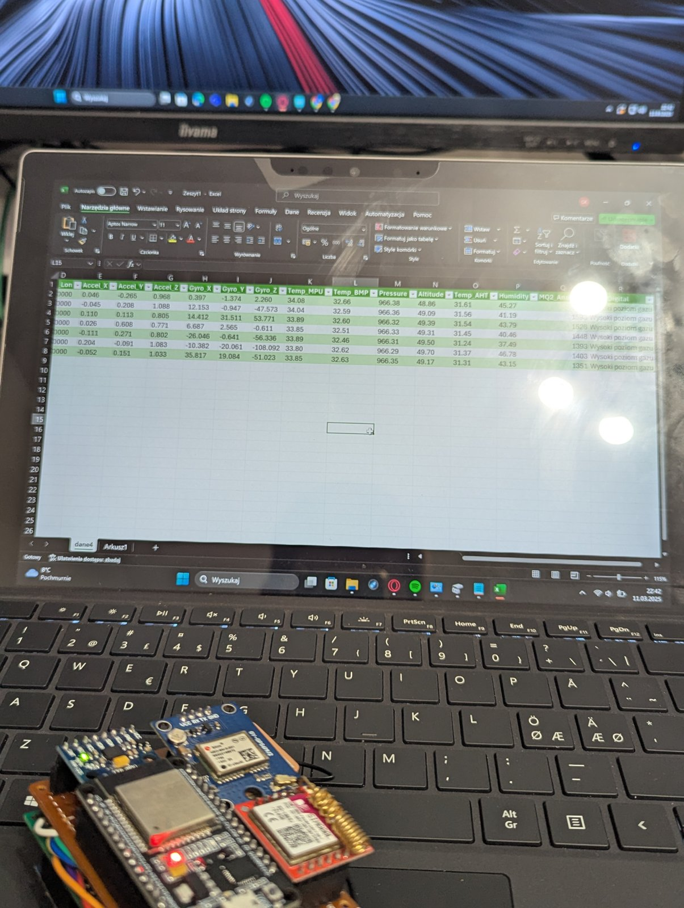
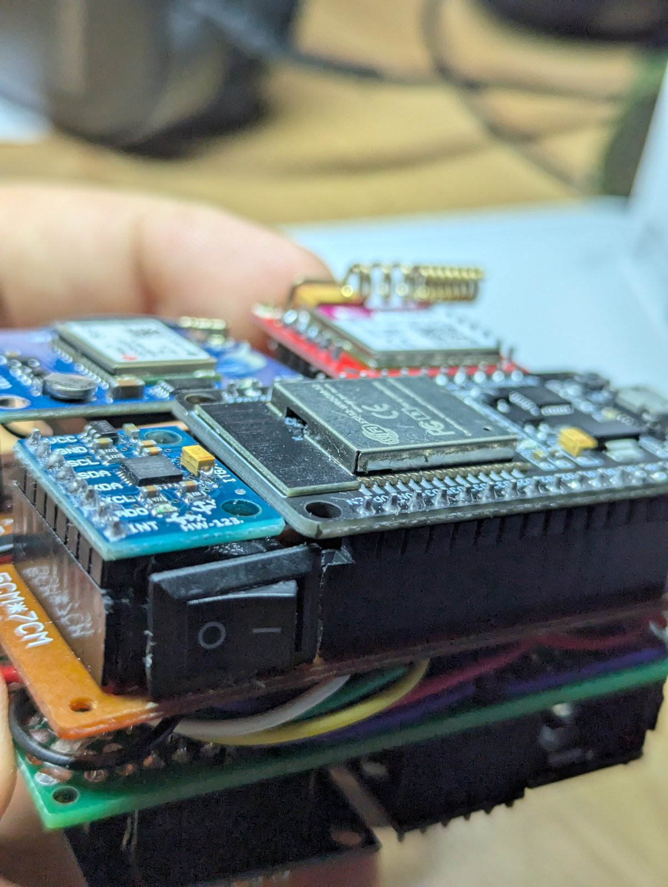

# Meteorological Balloon

This is my first project using ESP32. The goal was to design and build a telemetry system for a meteorological balloon.

The system collects environmental and positional data during flight, stores it on an SD card, and periodically sends GPS location via SMS to enable recovery after landing.

The payload was launched on **17 March 2025** and recorded a complete flight — from the ground up to roughly **27 km** altitude, over a ground track of about **458 km**.



---

## Project Description

The system acts as a data logger mounted on a meteorological balloon.

During operation it:
- collects data from multiple sensors
- logs data to an SD card
- sends current GPS position via GSM

---

## Features

- GPS positioning (latitude, longitude, altitude)
- SMS with Google Maps link
- data logging to SD card
- time measurement using RTC and GPS
- temperature, pressure and humidity measurement
- motion and orientation measurement (IMU)
- GPS signal quality (HDOP, number of satellites)
- gas detection (MQ2)

---

## Hardware Components

### Microcontroller
- ESP32

### Communication
- SIM800L (GSM / SMS)
- GPS module (TinyGPS++)

### Sensors
- GY-521 (MPU6050) – accelerometer and gyroscope
- BMP280 – temperature, pressure, calculated altitude
- AHT10 – temperature and humidity
- MQ2 – gas sensor

### RTC
- DS3231

### Storage
- SD card

---

## Build Process

### Prototyping on a breadboard (3 March 2025)

The first stage was wiring all modules on a breadboard and verifying that every
sensor responds on the I2C bus and that the GPS and SIM800L modules communicate
over their respective UARTs.

| | |
|---|---|
|  |  |
|  |  |

### Assembly and soldering (10–11 March 2025)

Once the prototype was working, the modules were moved to a permanent layout,
soldered and arranged so that the whole set would fit inside the payload box.

| | |
|---|---|
|  |  |
|  |  |

### Finished payload (13 March 2025)



---

## Program Operation

### Initialization (setup)
- initialization of all sensors and modules
- creation of a new data file (e.g. dane1.txt, dane2.txt)
- writing header to the file

---

### Main Loop

The program runs continuously and performs:

#### Data acquisition
- GPS data (position, speed, course)
- number of satellites and HDOP
- IMU data (acceleration, angular velocity)
- environmental data (temperature, pressure, humidity)
- gas sensor readings
- time from RTC and GPS

#### Data logging
- all data is appended to a text file on the SD card

#### SMS transmission
- sent periodically (every 10 minutes)
- contains a Google Maps link: https://www.google.com/maps?q=LAT,LON

---

## Flight Data — 17 March 2025

The full log is in [`data/flight_2025-03-17.txt`](data/flight_2025-03-17.txt):
749 records, tab-separated, 25 columns.

### Summary

| Parameter | Value |
|---|---|
| Date | 17 March 2025 |
| Logging window (RTC) | 14:29:28 – 16:36:09 |
| Duration | ~127 min |
| Records | 749 (one every ~10 s) |
| Launch position | 50.3315 N, 19.5918 E (Silesia) |
| Last GPS fix | 54.4227 N, 20.3601 E |
| Ground track | ~458 km, heading north |
| Max altitude (barometric) | **27 195 m** (p = 6.58 hPa) |
| Max altitude (GPS) | 15 794 m (module limit) |
| Mean ascent rate | ~5.2 m/s |
| Max ground speed | ~155 km/h |
| Pressure range | 961.68 → 6.58 hPa |
| Satellites in view | 0–14 (median 9) |
| HDOP | 0.8 – 9.8 |

### Altitude profile

| Flight time | GPS altitude | Pressure | Barometric altitude | Humidity |
|---:|---:|---:|---:|---:|
| 0 min | — | 856.9 hPa | 1 051 m | 13.7 % |
| 10 min | 3 717 m | 623.2 hPa | 3 596 m | 13.4 % |
| 20 min | 6 339 m | 438.9 hPa | 6 225 m | 12.7 % |
| 30 min | 8 956 m | 296.1 hPa | 8 975 m | 11.9 % |
| 40 min | 12 273 m | 182.1 hPa | 12 097 m | 11.3 % |
| 50 min | 15 789 m | 105.3 hPa | 15 291 m | 10.9 % |
| 60 min | *invalid* | 65.4 hPa | 17 803 m | 10.7 % |
| 70 min | *invalid* | 35.6 hPa | 20 707 m | 10.1 % |
| 80 min | *invalid* | 21.6 hPa | 22 843 m | 9.8 % |
| 90 min | *invalid* | 12.6 hPa | 24 938 m | 9.3 % |
| 100 min | *invalid* | 7.4 hPa | 26 801 m | 8.7 % |
| 110 min | *invalid* | 120.2 hPa | 14 548 m | 8.9 % |
| 120 min | *invalid* | 542.8 hPa | 4 652 m | 8.6 % |

Ascent was steady at about 5 m/s up to roughly **t+102 min**, where pressure
reached its minimum of 6.58 hPa. After that the pressure rises sharply — the
balloon had burst and the payload was descending under its parachute.

---

## Lessons Learned / Known Issues

The flight worked, but the log exposed several problems worth documenting.

**1. GPS altitude stops being usable above ~16 km.**
GPS receivers enforce the COCOM limits and stop reporting a valid fix above
18 000 m. From about `t+50 min` the altitude field returns nonsense
(negative values, sudden jumps). Above that point only the barometric altitude
from BMP280 is meaningful.

**2. BMP280 is used far outside its rated range.**
The datasheet range is 300–1100 hPa (roughly 0–9 km). Everything the sensor
reported above ~9 km is extrapolation, so the 27 km figure should be treated as
an estimate rather than a measurement.

**3. Satellite count was logged in binary.**
```cpp
dataFile.print(gps_satelite, 2);   // int + base → prints in BASE 2
```
For an `int`, the second argument of `print()` is the numeral base, not the
number of decimal places. That is why the column contains values like `1110`
(= 14 satellites) and `1011` (= 11). Fix: `dataFile.print(gps_satelite);`

**4. HDOP is stored ×100.**
`gps.hdop.value()` returns hundredths, so `390` means HDOP 3.9. Divide by 100
when reading, or use `gps.hdop.hdop()`.

**5. Sea-level reference pressure is hardcoded.**
```cpp
#define SEA_LEVEL_PRESSURE_HPA 972
```
The actual QNH on the launch day was different, which is why the first record
already shows 1 051 m at ground level. The reference should be taken from a
METAR/QNH source before launch, or the first reading should be used as the
zero point.

**6. GPS date/time columns are swapped relative to the header.**
The header declares `GPS_Data` then `GPS_Godzina`, but the code writes time
first and date second, so the two columns are transposed in the file. The RTC
also drifted about 5 hours from GPS time — it had been set from the compile
timestamp (`rtc.adjust(DateTime(F(__DATE__), F(__TIME__)))`) and never
resynchronised from GPS.

**7. MQ2 digital output was always active.**
The whole log reads `Wysoki poziom gazu` — the comparator threshold on the
module was set too low. The analog channel (118–3350) still carries usable
information.

**8. All temperature sensors stayed at 35–44 °C for the entire flight.**
Ambient temperature at 25 km is around −50 °C, so the sensors were clearly
measuring the inside of an insulated payload box warmed by the electronics.
Measuring outside air requires a probe mounted outside the enclosure, shielded
from direct sunlight.

**9. The logging interval does not match the code.**
`delay(5000)` suggests 5 s, but the measured interval is ~10 s because of the
sensor reads plus the SD open/close on every record. The declared
`sensorInterval` / `lastSensorRead` variables are never used — the loop is
timed by a blocking `delay()` instead. Also, `smsInterval = 600000` is
10 minutes, while the comment next to it says 15.

---

## Repository Structure

```
.
├── Balon_SD.ino                      # ESP32 firmware
├── README.md
├── data/
│   └── flight_2025-03-17.txt         # raw flight log (749 records)
└── docs/
    ├── flight_profile_2025-03-17.png # altitude, pressure, temperature, ground track
    └── images/                       # build process photos
```
